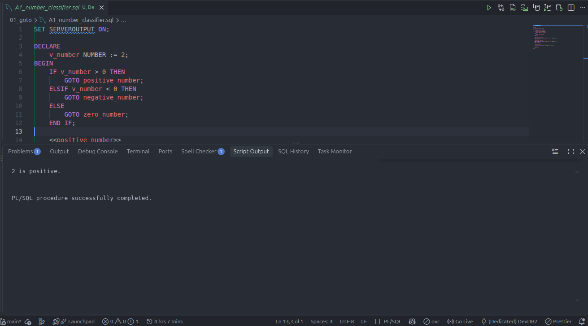
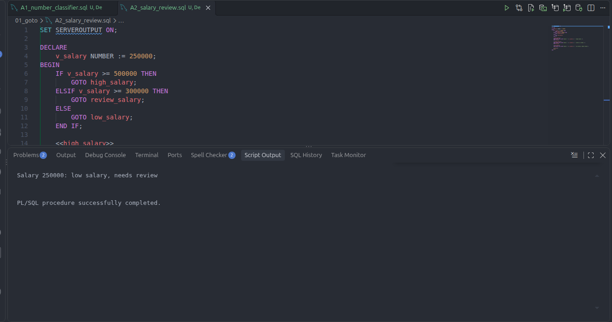
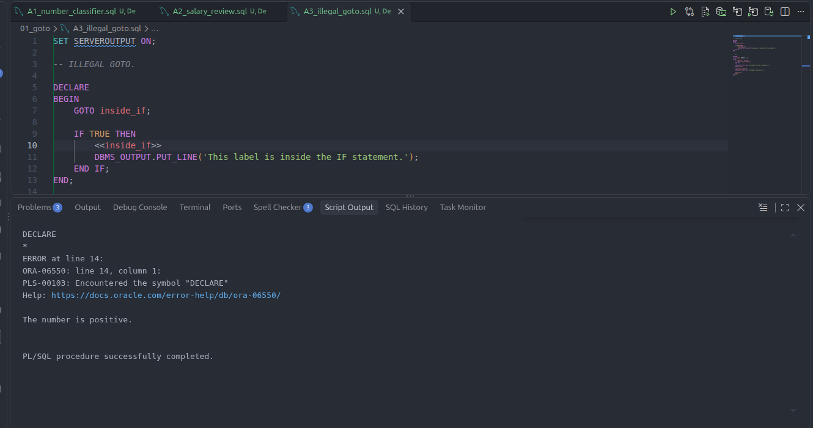
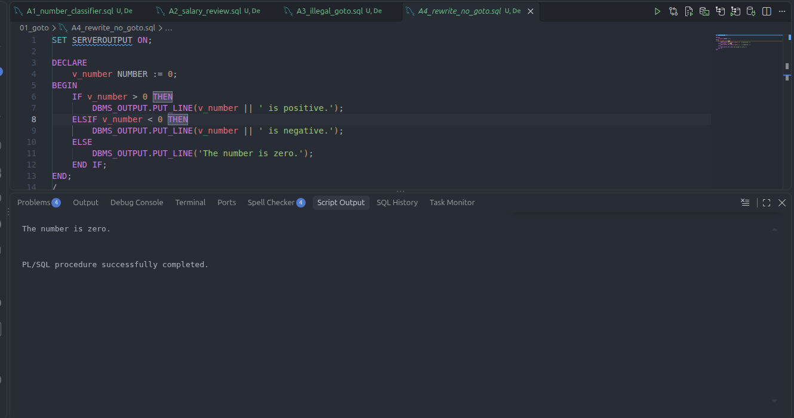
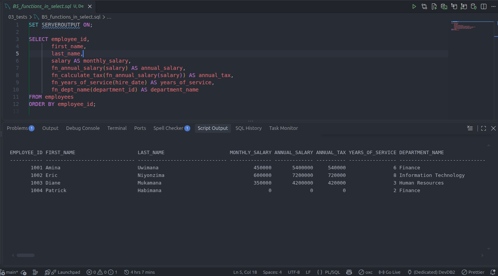
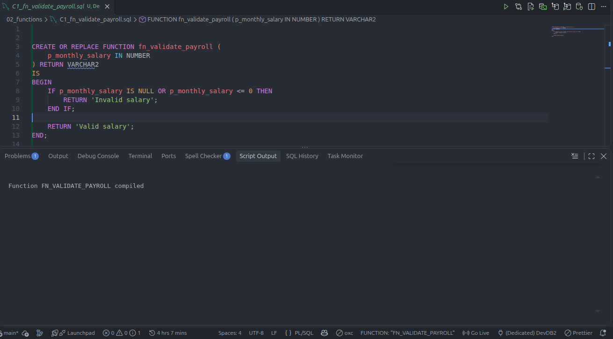

# PL/SQL GOTO Statements and Functions

**Name:** Gakuru Elijah 
**Student ID:** 28808
**Group:** C  
**Course:** Database Development with PL/SQL (INSY 8311)  
**Instructor:** Eric Maniraguha  
**Assignment:** 3
**Oracle Environment:** Oracle XE 21 
**SQL Client:** SQL Developer VS Code Extension  
**Repository:** plsql-goto-functions-28808--Gakuru

## Overview

This individual assignment practices PL/SQL `GOTO` statements, stored functions, exception handling, and calling functions from SQL queries. It uses employee and department data for the function examples.

## Assignment Tasks

- **Part A — GOTO:** classify a number, review a salary, demonstrate an illegal `GOTO` and its correction, and rewrite a classifier without `GOTO`.
- **Part B — Functions:** calculate annual salary, years of service, tax, and department name; then call functions from a `SELECT` query.
- **Part C — Combined task:** validate payroll and write a reflection.

## Repository Structure

```text
00_setup/       Table creation and sample data
01_goto/        A1 through A4 PL/SQL blocks
02_functions/   B1 through B4 and C1 stored functions
03_tests/       B5 query and function test scripts
screenshots/    Assignment output screenshots
docs/          Reflection
```


## Results and Screenshots

The screenshots below show the output from each assignment task.

### A1 — Number Classification



### A2 — Salary Review



### A3 — Illegal GOTO and Correction



### A4 — Classifier Without GOTO



### B5 — Function Calls in a SELECT Query



### C1 — Payroll Validation



## Reflection

See [docs/REFLECTION.md](docs/REFLECTION.md).
